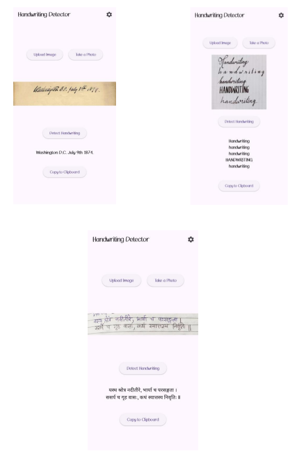

# HandWrite


HandWrite is a **Flutter-based web app** that utilizes **Firebase Genkit** and **Gemini API** to detect and analyze handwriting from uploaded images.

## Features 🚀
- Upload handwritten images for text extraction.
- Utilize **Gemini API** for AI-powered handwriting recognition.
- Store and manage extracted text using **Firebase Genkit**.
- User-friendly and responsive UI.

## Tech Stack 🛠️
- **Frontend:** Flutter (Dart)
- **Backend:** Firebase Genkit
- **AI Processing:** Gemini API

## Installation & Setup ⚙️
1. **Clone the repository:**
   ```bash
   git clone https://github.com/SRB1025X/handwrite.git
   cd handwrite
   ```
2. **Install dependencies:**
   ```bash
   flutter pub get
   ```
3. **Run the application:**
   ```bash
   flutter run
   ```



## Project Structure 📂
```
HandWrite/
│── lib/
│   │── main.dart         # Entry point
│   │── screens/          # UI Screens
│   │── services/         # Firebase & API integration
│   │── widgets/          # Reusable components
│── assets/               # Images and resources
│── pubspec.yaml          # Dependencies
```

## Future Enhancements 🔮
- Improve handwriting recognition accuracy.
- Support multiple languages.
- Enhance UI/UX with animations and themes.
- Export extracted text to various formats.

## Contributing 🤝
Feel free to fork this repository and submit pull requests for improvements. Contributions are welcome!

## License 📜
This project is licensed under the **MIT License**.

---

### 📬 Contact
For any queries or collaborations, reach out via [GitHub](https://github.com/SRB1025X).
